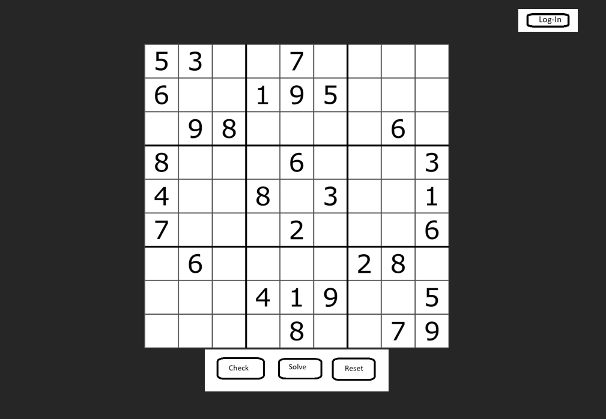
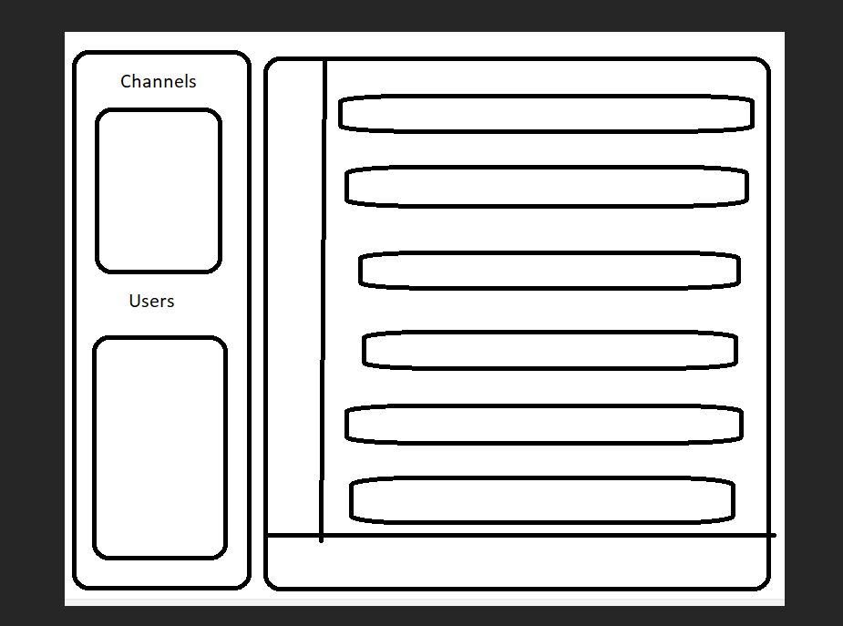

# Secret Soduku

## Overview

Secret Sudoku is a fully functional Sudoku game app, however with a secret function! After hovering at the top, a login button will appear which will enable the user to login to a secret work messaging app!

## Technologies Used

* HTML5
* CSS
* React
* JavaScript
* Stream API (messaging)

## User Stories

### Soduku

* Accessing Sudoku
* Placing a number in each square
* Removing a number in each square
* Checking the solution
* Solving the problem
* Resetting the Sudoku board

### Messaging

* Log-in
* Sign-up
* Upload photo
* Search bar to search for specific channels/users
* Push notifications
* Access different channels per subject matter
* Direct chats
* Send messages
* Send gifs/images
* Add reactions to messages
* Reply to specific messages

## ERDs/Wireframing

## Schedule

* Day 1 – Planning, editing templates
* Day 2 – Basic models
* Day 3 – ensure functionality
* Day 4 – Debugging
* Day 5 – formatting/design
